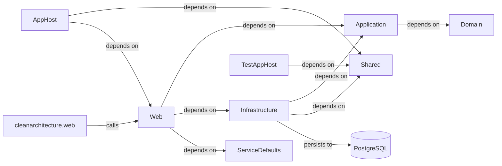

# Architecture

## System Diagram

_Generated from the application's knowledge graph (project references, calls, persistence)._

## Detected Patterns
The application appears to follow a **Layered Architecture** pattern, leveraging **Clean Architecture principles** based on interfaces, services, and references. It utilizes Dependency Injection (DI) throughout its components to manage dependencies effectively.

## Solution Structure

The application consists of several repositories and projects, each with specific responsibilities:

- **Domain**: This project defines the core business entities, including `TodoItem` and `TodoList`. It plays a crucial role in encapsulating business logic and domain rules.

- **Infrastructure**: The Infrastructure project handles external resources and services. It contains the `ApplicationDbContext`, which persists data to a `PostgreSQL` database, and implements the `IdentityService` for managing authentication.

- **Application**: This project acts as the mediator between the Domain and Infrastructure layers. It contains the configuration for CQRS (Command Query Responsibility Segregation) through commands such as `CreateTodoItemCommand` and queries like `GetTodosQuery`. Interfaces like `IApplicationDbContext` and `IIdentityService` are defined here for dependency injection.

- **Shared**: This project holds common utilities and shared components that can be used across other projects in the solution.

- **ServiceDefaults**: This project defines default service configurations, particularly for resilience and service discovery.

- **AppHost**: This component manages the application host context and depends on the Shared and Web projects for integration.

- **Web**: The Web project serves as the API interface for the application, providing endpoints for managing todo items, user authentication, and retrieving weather forecasts via a minimal API design.

- **Tests**: There are multiple test projects (e.g., `Domain.UnitTests`, `Application.FunctionalTests`, etc.) that are structured to test various layers and functionalities within the application.

- **cleanarchitecture.web**: This is an Angular front-end client that interacts with the Web API, consisting of various components like `todo`, `weather`, and user authentication flows.

## Component Responsibilities
- **Domain**: Hosts business entities and domain logic.
- **Infrastructure**: Manages data access and external dependencies like databases.
- **Application**: Mediates commands and queries, encapsulating application logic.
- **Shared**: Provides common libraries or utilities used across projects.
- **ServiceDefaults**: Contains basic service configurations for external integrations.
- **AppHost**: Sets up the application environment and manages dependencies.
- **Web**: Exposes API endpoints for various functionalities.
- **Tests**: Ensures functionality correctness and maintains quality through different testing strategies.

## How the Pieces Fit Together
In the application architecture, the dependencies are structured as follows:

1. The **Web** project interfaces with incoming HTTP requests. It depends on the **Application**, **Infrastructure**, and **ServiceDefaults** projects to execute business logic and access data.

2. The **Application** project depends on the **Domain** project for domain entities and business rules. It also relies on **Infrastructure** to interact with external resources and data persistence mechanisms.

3. The **Infrastructure** project depends on **Shared** for common utilities, and it directly interacts with a **PostgreSQL** database for data persistence.

4. The **AppHost** integrates the **Shared** project and the **Web** project, ensuring that the application is properly configured and hosted.

5. The **cleanarchitecture.web** Angular client calls the endpoints defined in the **Web API**, leading to actions that interact with commands and queries defined in the **Application** project.

6. The testing projects (e.g., `TestAppHost`, `Application.UnitTests`, and others) depend on relevant subsets of the application components, including **Shared** and **Web**, to validate the functionality and correctness of individual parts and the overall application.
