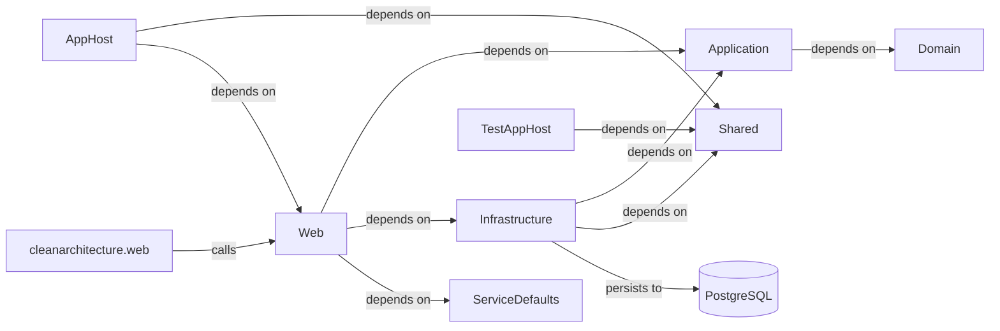

# Architecture

## System Diagram

_Generated from the application's knowledge graph (project references, calls, persistence)._

## Detected Patterns
The architecture of the CleanArchitecture application appears to be aligned with several established design patterns, including:
- **Layered Architecture**: The separation of concerns is evident through the distinct layers of Domain, Application, Infrastructure, and Web projects.
- **Dependency Injection**: The use of interfaces in the Application and Infrastructure layers implies Dependency Injection principles, promoting loose coupling among components.
- **Clean Architecture**: The structure suggests a Clean Architecture approach based on interfaces and services, particularly with the presence of domain entities and their interaction through services.

## Solution Structure
The CleanArchitecture application is composed of the following repositories and their projects, each with defined responsibilities:

1. **Domain**
   - **Type**: DotNetLibrary
   - **Responsibilities**: Contains the domain entities such as `TodoItem` and `TodoList`.

2. **Infrastructure**
   - **Type**: DotNetLibrary
   - **Responsibilities**: Provides access to data through EF Core entities, includes the `ApplicationDbContext`, and implements the `IdentityService` for authentication.

3. **Application**
   - **Type**: DotNetLibrary
   - **Responsibilities**: Contains business logic, application services, and command/query handlers such as `CreateTodoItemCommand` and `GetTodosQuery`. It defines interfaces for services, including `IIdentityService`.

4. **Shared**
   - **Type**: DotNetLibrary
   - **Responsibilities**: A shared library without specific entities or services but can be utilized by other projects.

5. **ServiceDefaults**
   - **Type**: DotNetLibrary
   - **Responsibilities**: Holds default services, potentially for configuration or service discovery.

6. **AppHost**
   - **Type**: DotNetOther
   - **Responsibilities**: Serves as the application host, dependent on Shared and Web projects.

7. **Web**
   - **Type**: DotNetApi
   - **Responsibilities**: Acts as the API layer, exposing endpoints related to TODO items, user management, and weather forecasts.

8. **ClientApp (Angular)**
   - **Type**: Angular
   - **Responsibilities**: Frontend application managing routes and components for Todo, Weather, user login and registration.

## Component Responsibilities
- **Endpoints**: The Web project defines several minimal API endpoints, including:
  - Todo Items (create, update, delete, fetch)
  - Todo Lists (create, update, delete, fetch)
  - User actions (logout)
  - Weather forecasts (fetch)
  
- **Identity Services**: Managed by the Infrastructure project which includes the `IdentityService` for user authentication.

- **Data Access**: Managed by the Infrastructure with persistence to PostgreSQL via EF Core, ensuring that data transactions are handled appropriately.

## How the Pieces Fit Together
The CleanArchitecture application functions through a series of dependencies and API calls as follows:

1. The **Web** project acts as the front-facing API layer, depending on the **Application**, **Infrastructure**, and **ServiceDefaults** projects.
2. The **Application** layer interacts with the **Domain** to manage business logic while depending on the **Infrastructure** for data access.
3. The **Infrastructure** not only serves the **Application** for business functionalities but also persists data to the PostgreSQL database.
4. The **AppHost** integrates both the **Shared** and **Web** components, functioning as a central entry point for the application.
5. The **cleanarchitecture.web** Angular application connects to the **Web** API, issuing calls to endpoints provided by the Web project to perform various operations.
  
Through these relationships, components communicate effectively, ensuring a robust and maintainable application structure.
