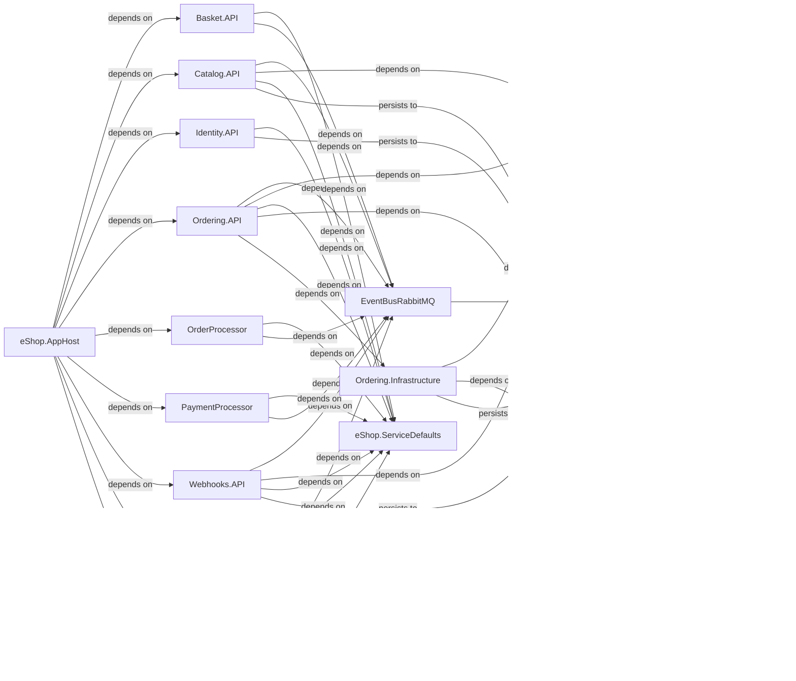

# Architecture

## System Diagram

_Generated from the application's knowledge graph (project references, calls, persistence)._

## Detected Patterns
The architecture of the eShop application is likely based on a combination of established design patterns, such as Repository, Layered, Dependency Injection (DI), and Clean Architecture principles. The application appears to employ a modular structure allowing for separation of concerns among different components and services.

## Solution Structure
The eShop application consists of multiple repositories and projects, each with defined responsibilities:

1. **Webhooks.API**: Manages webhook interactions. Implemented using a minimal API with endpoints for various webhook actions.
2. **Catalog.API**: Handles operations related to product catalog items, including retrieval, creation, and updates. Also uses minimal API for routing.
3. **Ordering.Domain**: Contains core domain interfaces related to ordering, such as repositories and aggregate roots that define the order model.
4. **OrderProcessor**: Manages order processing logic but does not expose API endpoints.
5. **eShop.ServiceDefaults**: Provides shared services and authentication mechanisms across the application.
6. **WebhookClient**: Implements webhook receiving and authentication functionalities with minimal API endpoints.
7. **EventBusRabbitMQ**: Facilitates messaging between components using RabbitMQ but does not provide any controllers.
8. **Identity.API**: Manages user identity and authentication, including login and consent handling via multiple controllers.
9. **PaymentProcessor**: A non-API service for handling payment operations but lacking further specifics in the repository.
10. **Ordering.Infrastructure**: Contains implementations for infrastructure concerns associated with the ordering functionality, including data context.
11. **Ordering.API**: Provides endpoints to manage orders and customer interactions, using a set of CRUD operations.
12. **WebApp**: Client-facing components to facilitate user interaction with the eShop services and manage application state.
13. **eShop.AppHost**: Hosts various application components, supporting routing and orchestration of services.
14. **Basket.API**: Manages shopping basket related functionality via a set of services and API endpoints.
15. **WebAppComponents**: Provides reusable components for the WebApp interfacing with services.
16. **ClientApp**: Handles mobile and other client applications providing necessary services and state management.
17. **HybridApp**: Targets mobile platforms utilizing shared services across platforms.
18. **IntegrationEventLogEF**: Logs integration events to persist communication between microservices.
19. **Various Testing Projects**: Include unit tests and functional tests for various components of the eShop application.

## Component Responsibilities
- **Webhooks.API**: Handles webhook requests and responses, interacting with event logging and service defaults.
- **Catalog.API**: Manages catalog items and integrates with shared services for common functionalities.
- **Ordering.API**: Processes user orders and interacts with infrastructure and domain services.
- **Identity.API**: Ensures user management and authentication.
- **Basket.API**: Provides access to shopping basket services.
- **WebApp**: Serves as the user interface layer that connects to multiple APIs and provides a consolidated user experience.
- **IntegrationEventLogEF**: Keeps track of integration events across different services to ensure reliable communication.

## How the Pieces Fit Together
The application flow can be described through the relationships defined in the metadata:

- The **eShop.AppHost** is the central orchestrator, depending on multiple APIs like **Catalog.API**, **Identity.API**, **Ordering.API**, **Basket.API**, and services such as **Webhooks.API** and **PaymentProcessor**.
- The **WebApp** serves as the frontend for users, leveraging services such as **BasketService**, **OrderingService**, and connecting to the **EventBusRabbitMQ** for message handling.
- **Webhooks.API** and **Catalog.API** persist data to **PostgreSQL**, indicating that they handle database interactions via Entity Framework Core.
- The **Ordering.API** and **Ordering.Infrastructure** rely on one another, with the Infrastructure layer providing the necessary data context to manage orders.
- **EventBusRabbitMQ** is used across various APIs to enable message-driven communication, helping trigger events based on actions carried out within the APIs.
- The **IntegrationEventLogEF** connects with the **EventBus** to log events and maintain communication through RabbitMQ.
- Various components, notably the **Identity.API** and **WebhookClient**, utilize shared services via **eShop.ServiceDefaults** for authentication.

This interconnected structure posits a modular design, allowing various projects within the eShop to work cohesively while adhering to their responsibilities.
