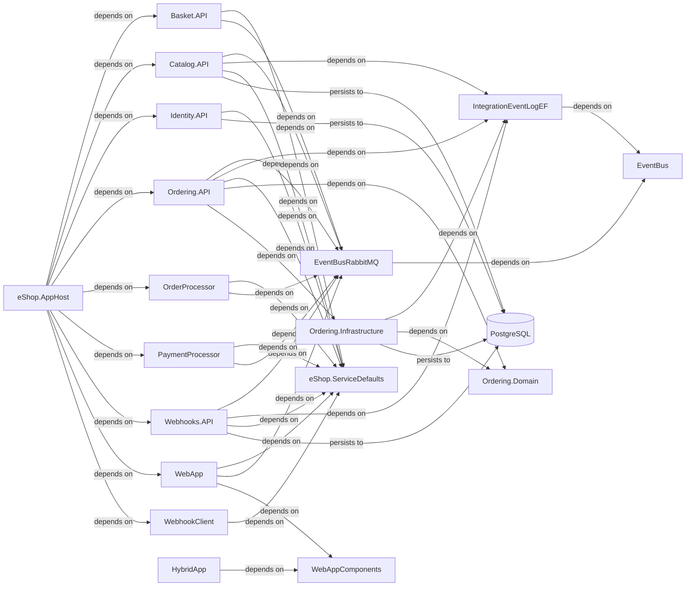

# Architecture

## System Diagram

_Generated from the application's knowledge graph (project references, calls, persistence)._

## Detected Patterns
- **CQRS**: Detected evidence of 10 command/query types with MediatR indicating that the application follows the Command Query Responsibility Segregation pattern.
- **Repository Pattern**: Detected through the presence of repository interfaces such as `IBuyerRepository`, `IOrderRepository`, and `IRepository`.
- **Layered Architecture**: Likely structured with a separation of concerns as indicated by the call graph showing a clear flow from controllers to services to repositories.
- **Dependency Injection**: Detected through components being resolved via constructor injection and various dependency injection registrations.

## Solution Structure
The application consists of the following projects, each with defined responsibilities:

- **Webhooks.API**: API responsible for handling webhooks and related integrations.
- **Catalog.API**: API responsible for product catalog management.
- **Ordering.Domain**: Library containing domain entities and logic related to ordering.
- **OrderProcessor**: Library for processing orders with business rules.
- **eShop.ServiceDefaults**: Library providing default services and configurations used across the application.
- **WebhookClient**: API for managing and sending webhooks to external systems.
- **EventBusRabbitMQ**: Library handling event bus functionalities, likely for message processing.
- **Identity.API**: API responsible for user identity and authentication.
- **PaymentProcessor**: API for processing payments.
- **Ordering.Infrastructure**: Library dealing with ordering infrastructure aspects, including data access.
- **Ordering.API**: API for managing order-related operations.
- **WebApp**: API for the main web application functionalities.
- **eShop.AppHost**: Host for the eShop application.
- **Basket.API**: API for managing user shopping baskets.
- **EventBus**: Library facilitating event bus operations.
- **WebAppComponents**: Library containing shared components for the web application.
- **ClientApp**: Client application for various platforms (Android, iOS, MacCatalyst).
- **HybridApp**: Hybrid application designed for multiple platforms.
- **IntegrationEventLogEF**: Library for logging integration events in the entity framework.
- **Basket.UnitTests**, **ClientApp.UnitTests**, **Ordering.FunctionalTests**, and **Catalog.FunctionalTests**: Projects containing unit and functional tests for their respective components.

## Component Responsibilities
Each project is responsible for distinct areas:
- **Webhooks.API** interacts with external systems to receive updates.
- **Catalog.API** handles operations related to product information.
- **Ordering.Domain** encapsulates core domain logic pertaining to orders.
- **OrderProcessor** implements business processes for order fulfillment.
- **eShop.ServiceDefaults** provides common utilities and defaults.
- **WebhookClient** sends information to external webhook endpoints.
- **EventBusRabbitMQ** manages events between services.
- **Identity.API** manages authentication and user identity.
- **PaymentProcessor** executes payment transactions.
- **Ordering.Infrastructure** facilitates data access and persistence for orders.
- **Ordering.API** acts as an interface for order requests.
- **WebApp** serves the main application functionalities.
- **eShop.AppHost** serves as the main host for the application functionalities.
- **Basket.API** maintains user basket state during shopping.
- **EventBus** supports inter-service communication.
- **WebAppComponents** holds shared UI components.
- **ClientApp** represents mobile and cross-platform use cases.
- **HybridApp** integrates functionalities for a hybrid user experience.
- **IntegrationEventLogEF** manages logging for integration events.
- Test projects ensure reliability through automated testing.

## How the Pieces Fit Together
Based on the relationships detected:
- `eShop.AppHost` acts as the main entry point and depends on various APIs including `Basket.API`, `Catalog.API`, `Identity.API`, `Ordering.API`, `Webhooks.API`, and others.
- APIs like `Ordering.API`, `Catalog.API`, and `Identity.API` depend on the `eShop.ServiceDefaults` for shared configurations and services.
- The `EventBusRabbitMQ` is a shared component for event management and several APIs rely on it for consistent message processing.
- Persistence of data related to several APIs like `Webhooks.API`, `Catalog.API`, `Identity.API`, and `Ordering.Infrastructure` occurs in a PostgreSQL database, as indicated by the "persists to" relationships.

## Frontend
No Angular project was detected in the metadata; thus, there are no components, services, routes, guards, or interceptors to describe. The focus is likely on .NET-based APIs and libraries for backend services.
