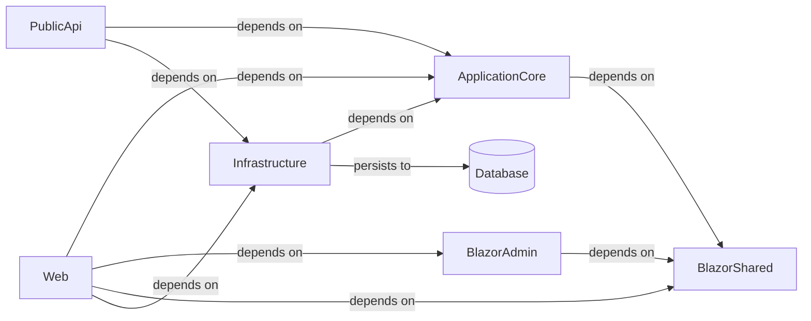

# Architecture

## System Diagram

_Generated from the application's knowledge graph (project references, calls, persistence)._

## Detected Patterns
The architecture of the application appears to utilize several design patterns, including:
- **Repository Pattern:** Promotes a separation of concerns and encapsulates data access logic, suggesting the use of repositories for managing data.
- **Layered Architecture:** Indicates distinct layers for separation of functionalities (e.g., presentation, business logic, data access).
- **Dependency Injection (DI):** Likely implemented, enhancing testability and separation of dependencies.
- **Clean Architecture:** Suggests usage of interfaces and services to define boundaries and interactions between different parts of the application.

## Solution Structure
The eShopOnWeb application is structured into multiple projects within the main repository:
- **BlazorAdmin:** A DotNetApi project that provides administration capabilities, utilizing various services such as `CatalogItemService` and `ToastService`, and depends heavily on the `BlazorShared` project for shared logic.
- **Infrastructure:** A DotNetLibrary project that contains data access components and services (`BasketQueryService`, `IdentityTokenClaimService`), managing the identity and catalog context databases.
- **PublicApi:** A DotNetApi project that defines the entry points for API interactions, implementing several endpoints for catalog items and brands. It relies on both `ApplicationCore` and `Infrastructure` projects.
- **ApplicationCore:** A DotNetLibrary project that encapsulates the core business logic and domain entities, defining services like `OrderService` and `BasketService`.
- **BlazorShared:** A DotNetLibrary project that houses shared interfaces and entities, used by both the BlazorAdmin and ApplicationCore projects.
- **Web:** A DotNetApi project, acting as the main entry point for user interactions, managing API calls and utilizing services for basket and catalog view models. It interrelates with multiple projects, encasing critical functionalities.
- **Testing Projects:** Several projects (`PublicApiIntegrationTests`, `IntegrationTests`, `UnitTests`, and `FunctionalTests`) designed for assessing the different parts of the application.

## Component Responsibilities
Each component serves distinct responsibilities:
- **BlazorAdmin:** Manages the admin features of the application including item management.
- **Infrastructure:** Handles data persistence and identity services, interfacing with databases and providing necessary data access services.
- **PublicApi:** Exposes minimal API endpoints to interact with the underlying data and services, offering public access.
- **ApplicationCore:** Contains business logic and definitions of domain entities, playing a critical role in the application's core functionality.
- **BlazorShared:** Contains shared resources, including common interfaces and entities used across multiple projects.
- **Web:** Manages user interactions through a client-side application, integrating front-end components with various services.

## How the Pieces Fit Together
The flow of the application starts when the user interacts with the Web project. 

1. The **Web** project makes API calls to the **PublicApi** to perform operations such as retrieving catalog items or managing user accounts.
2. The **PublicApi** depends on both the **ApplicationCore** and **Infrastructure** projects:
   - It calls services from the **ApplicationCore** to implement business logic, such as placing orders or accessing basket services.
   - It also utilizes the **Infrastructure** project to manage database interactions and user identity handling.
3. The **Infrastructure** project persists data to a database, indicated by its relationship of "persists to" with the database (though the specific database technology is not detailed in the metadata).
4. The **BlazorAdmin** depends on the **BlazorShared** project for common functionalities, highlighting a shared resource strategy.
5. The **Web** project interacts with shared entities and services from the **BlazorShared** to manage its own data flow and user interface components.

Overall, these interdependencies create a structured flow that ensures smooth interactions between components and promotes organized data handling throughout the application.
