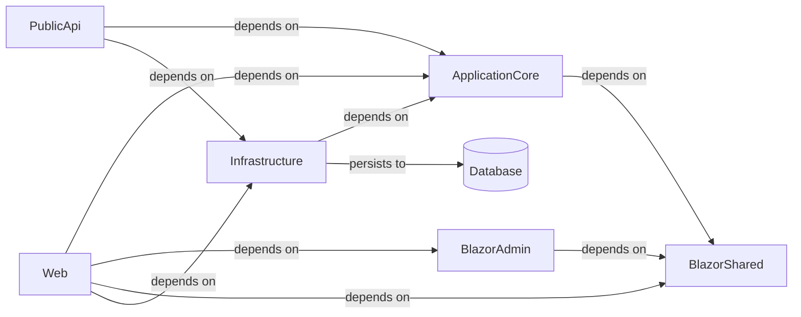

# Architecture

## System Diagram

_Generated from the application's knowledge graph (project references, calls, persistence)._

## Detected Patterns
The architecture of the `eShopOnWeb` application appears to follow patterns associated with **Layered Architecture** and **Clean Architecture**, leveraging principles such as Dependency Injection (DI) and separation of concerns. Each project is structured around distinct functionalities, which facilitates maintainability and testability.

## Solution Structure
The application consists of the following repositories and projects, each with specific responsibilities:

1. **BlazorAdmin**  
   - **Type**: DotNetApi  
   - **Responsibilities**: Serves as the administration interface. Contains services for catalog item management, such as `CatalogItemService`, `CatalogLookupDataService`, and utilities like `HttpService` and `ToastService`. It depends on `BlazorShared`.

2. **Infrastructure**  
   - **Type**: DotNetLibrary  
   - **Responsibilities**: Provides core data access and identity functionalities. Houses DbContexts like `AppIdentityDbContext` and `CatalogContext`. Services for querying baskets and identity tokens are included. It depends on `ApplicationCore`.

3. **PublicApi**  
   - **Type**: DotNetApi  
   - **Responsibilities**: Acts as the public-facing API layer. It contains minimal API endpoints for managing catalog types and items. This project is responsible for routing and API documentation with Swagger. It depends on `ApplicationCore` and `Infrastructure`.

4. **ApplicationCore**  
   - **Type**: DotNetLibrary  
   - **Responsibilities**: Contains the domain entities and business logic, with interfaces for repository patterns and services like `BasketService` and `OrderService`. It connects with `BlazorShared`.

5. **BlazorShared**  
   - **Type**: DotNetLibrary  
   - **Responsibilities**: Contains shared entities and interfaces such as catalog items, brands, and lookup data required by both client and server components.

6. **Web**  
   - **Type**: DotNetApi  
   - **Responsibilities**: Provides the main web application interface, handling user interactions, along with controllers for user account management and order processing. It depends on several components, including `ApplicationCore`, `BlazorAdmin`, `BlazorShared`, and `Infrastructure`.

7. **Testing Projects**:
   - `PublicApiIntegrationTests`, `IntegrationTests`, `UnitTests`, and `FunctionalTests` ensure the reliability of the application through various testing strategies. They depend on respective services and APIs defined in the main projects.

## Component Responsibilities
- **BlazorAdmin**: UI for Admin functionalities and CRUD operations on catalog items.
- **Infrastructure**: Data access layer for identities and catalog data with Entity Framework Core and InMemory database support.
- **PublicApi**: RESTful endpoints for catalog operations, secured with JWT Authentication.
- **ApplicationCore**: Centralized business logic and data constructs representing the domain.
- **BlazorShared**: Provides common interfaces and entities shared across frontend and backend projects.
- **Web**: Manages user interactions and integrates various services for order management, authentication, and state management.

## How the Pieces Fit Together
The relationship between the components is primarily transactional and functional, with distinct dependencies among them:

- **`Web`** relies on `ApplicationCore` for core business logic concerning user actions, such as ordering processes and basket management. Additionally, it features dependencies on `BlazorAdmin` for administrative features and `BlazorShared` for shared data contracts, with operations that leverage the functionality in `Infrastructure` to persist user data and catalog items.
  
- **`PublicApi`** serves as the gate for external interactions, pulling services from `Infrastructure` and data models from `ApplicationCore` to handle API requests related to catalog management effectively.

- **`BlazorAdmin`** and `BlazorShared` provide backend services for catalog management and shared definitions required by both user-facing applications and administrative interfaces.

- **`Infrastructure`** is responsible for providing the necessary DbContext for identity and catalog data, underpinning the persistence strategy for the application.

- The **Dependency flow** can be summarized as follows: `Web` → `ApplicationCore`, `Web` → `BlazorAdmin`, `Web` → `BlazorShared`, `Web` → `Infrastructure`, `PublicApi` → `ApplicationCore`, `PublicApi` → `Infrastructure`, and `Infrastructure` persists data.

This structure forms a cohesive unit that demonstrates clarity in responsibilities and facilitates scalability within the application ecosystem.
