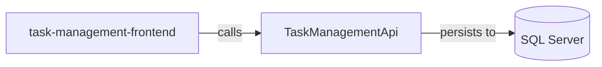

# Architecture

## System Diagram

_Generated from the application's knowledge graph (project references, calls, persistence)._

## Detected Patterns
The architecture of the TaskFlow application likely follows a Layered pattern. The main components are organized into repositories that suggest a Clean Architecture approach, utilizing interfaces and services. Dependency Injection (DI) practices are inferred from the use of interfaces for services and repositories in the API project.

## Solution Structure
The TaskFlow application is divided into two main repositories: 

1. **TaskManagementBackend**
   - **TaskManagementApi** (DotNetApi)
     - Responsible for providing the backend API endpoints for managing tasks, projects, and user authentication.
     - Contains multiple controllers such as `ProjectController`, `UserController`, `AuthController`, `AgentController`, and `TaskController`.

2. **TaskManagementFrontend**
   - **task-management-frontend** (Angular)
     - Responsible for the client-side application that interacts with the API.
     - Contains components for user interaction, including login, registration, and displaying projects and tasks.

## Component Responsibilities
- **TaskManagementApi**
  - **Controllers**:
    - `ProjectController`: Manages project-related requests (get all projects, get by ID, add, update, delete).
    - `UserController`: Manages user-related actions (get all users, get by ID, update, deactivate).
    - `AuthController`: Handles user authentication (login, register).
    - `AgentController`: Manages AI chat interactions.
    - `TaskController`: Oversees task-related requests (get all tasks, get by ID, add, update, delete).
  - **Services**:
    - Services implement business logic related to users, tasks, and projects, using interfaces for abstraction.
  - **Entities**:
    - `Project`, `Task`, and `User`: Define the key data structures handled by the application.

- **task-management-frontend**
  - **Components**:
    - Includes components for the assistant, login, navigation bar, project list, registration, and task list. These components provide the user interface for interactions.

## How the Pieces Fit Together
The TaskFlow application has a clear flow of information between the frontend and backend components:

1. The **task-management-frontend** interacts with the **TaskManagementApi** to retrieve and send data. This includes API calls for getting user information, managing tasks, and handling project data.
  
2. The **TaskManagementApi** persists data to the **SQL Server** (detected as the database). This relationship indicates that API calls from the frontend will lead to data being stored or queried from the SQL Server.

Overall, when a user interacts with the frontend (e.g., logging in or retrieving task lists), the frontend makes API calls to the backend, which processes these requests and interacts with the database accordingly. Thus, the frontend serves as the interface for user actions, while the backend handles business logic and data management.
