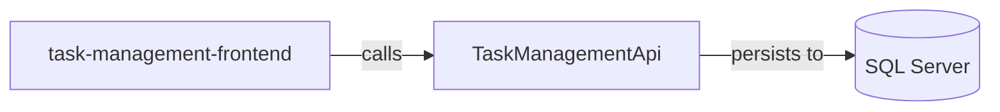
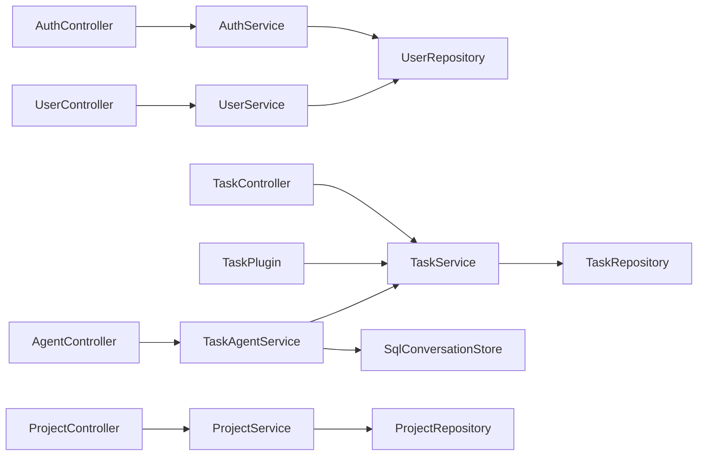

# Architecture

## System Diagram

_Generated from the application's knowledge graph (project references, calls, persistence)._

## Component Call Graph

_How components wire up (controller → service → repository → data), from constructor injection._

## Detected Patterns
The architecture of TaskFlow appears to be based on a layered and repository pattern, leveraging Clean Architecture principles. The application is designed using interfaces and services, which helps in maintaining separation of concerns and promoting testability.

## Solution Structure
The solution comprises two primary repositories:

1. **TaskManagementBackend**
   - **Project: TaskManagementApi**
     - A .NET-based web API built on ASP.NET Core.
     - Responsible for handling authentication, project management, task management, and user management via its various controllers.
     - Implements services that interact with repositories to persist data to SQL Server using Dapper.

2. **TaskManagementFrontend**
   - **Project: task-management-frontend**
     - An Angular application providing the user interface for interacting with the backend API.
     - Contains components for login, registration, project management, and task management functions.

## Component Responsibilities
### TaskManagementBackend (TaskManagementApi)
- **Controllers:**
  - **ProjectController**: Manages project-related API calls (CRUD operations).
  - **UserController**: Manages user-related API calls (CRUD operations).
  - **AuthController**: Handles user authentication (login and registration).
  - **AgentController**: Facilitates interaction with AI agents (e.g., chat).
  - **TaskController**: Manages task-related API calls (CRUD operations).

- **Services:**
  - **AuthService**: Handles authentication logic.
  - **TaskService**: Manages tasks and operations on task data.
  - **ProjectService**: Manages projects and operations on project data.
  - **UserService**: Manages users and operations on user data.
  - **TaskAgentService**: Provides functionalities for task automation involving AI.
  
- **Repositories:**
  - **UserRepository**: Handles data access for user entities.
  - **TaskRepository**: Handles data access for task entities.
  - **ProjectRepository**: Handles data access for project entities.

- **Entities:**
  - **User**: Represents user data.
  - **Project**: Represents project data.
  - **Task**: Represents task data.

### TaskManagementFrontend (task-management-frontend)
- **Components:**
  - **assistant**: Provides features related to AI assistants.
  - **login**: Interface for user login.
  - **navbar**: Navigation component.
  - **project-list**: Displays a list of projects.
  - **register**: Interface for user registration.
  - **task-list**: Displays a list of tasks.

## How the Pieces Fit Together
The TaskManagementFrontend communicates with the TaskManagementApi by making API calls. For instance, when a user accesses the project list component, it initiates calls to the ProjectController's API endpoints to retrieve project data. This data flow is facilitated by the relationships established in the backend.

From the TaskManagementApi, API calls made by the frontend reach the appropriate controller, which delegates the logic to corresponding services, such as AuthService, ProjectService, or TaskService. Each service interacts with its respective repository (e.g., ProjectRepository, UserRepository). The repositories handle the data persistence, which is executed against the SQL Server database using Dapper.

- **Frontend Call Flow:** 
  - **task-management-frontend** → Calls **TaskManagementApi** for project and task data.
  
- **Backend Processing Flow:** 
  - **ProjectController** calls **ProjectService**.
  - **ProjectService** retrieves data from **ProjectRepository**.
  - Data is persisted to SQL Server via **Dapper**, and responses are sent back to the frontend via the API. 

Overall, the interactions follow a structured approach, ensuring that each component within the application communicates effectively while adhering to their specific responsibilities.
